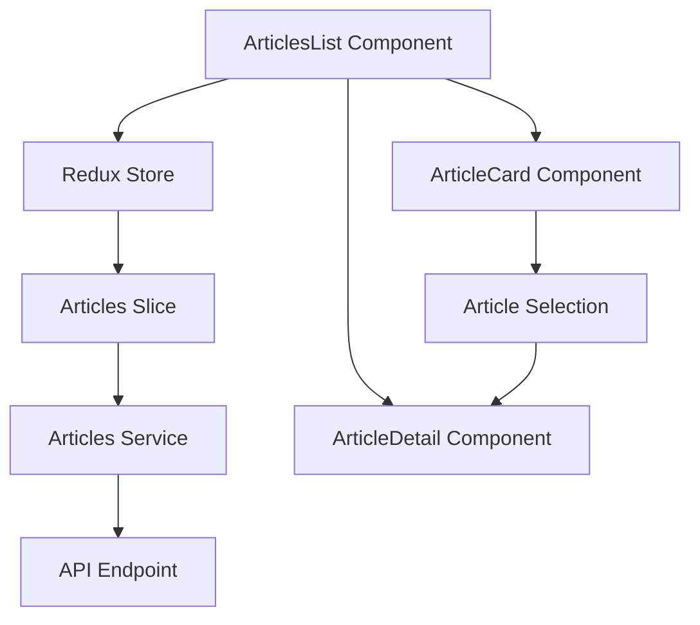

# Design Document: Articles Display Feature

## Overview

این فیچر برای نمایش لیست مقالات خبری در یک رابط کاربری مشابه CryptoPanic طراحی شده است. سیستم شامل یک sidebar برای نمایش لیست مقالات و یک ناحیه اصلی برای نمایش جزئیات مقاله انتخاب شده می‌باشد.

## Architecture

سیستم بر اساس معماری Redux Toolkit با TypeScript پیاده‌سازی می‌شود:



### Key Components:
- **ArticlesList**: کامپوننت اصلی مدیریت لیست
- **ArticleCard**: کامپوننت نمایش خلاصه مقاله
- **ArticleDetail**: کامپوننت نمایش جزئیات کامل
- **Articles Slice**: مدیریت state در Redux
- **Articles Service**: لایه ارتباط با API

## Components and Interfaces

### 1. ArticlesList Component

```typescript
interface ArticlesListProps {
  className?: string;
}

interface ArticlesListState {
  selectedArticleId: string | null;
}
```

**Responsibilities:**
- دریافت لیست مقالات از Redux store
- مدیریت انتخاب مقاله
- نمایش حالت‌های loading/error/empty

### 2. ArticleCard Component

```typescript
interface ArticleCardProps {
  article: Article;
  isSelected: boolean;
  onSelect: (articleId: string) => void;
}
```

**Responsibilities:**
- نمایش خلاصه اطلاعات مقاله
- مدیریت کلیک برای انتخاب
- نمایش sentiment score با رنگ مناسب

### 3. ArticleDetail Component

```typescript
interface ArticleDetailProps {
  article: Article | null;
}
```

**Responsibilities:**
- نمایش جزئیات کامل مقاله
- نمایش لینک منبع اصلی
- مدیریت حالت عدم انتخاب مقاله

## Data Models

### Article Interface (موجود)

```typescript
interface Article {
    _id: string;
    contents: {
        fa: {
            title: string;
            body: string;
        }
    }
    source_url: string;
    source_site: string;
    sentiment_score: number;
    tags: string[];
    article_published_date_at_source_site: string;
    article_published_date_at_source_site_jalali: string;
}
```

### Redux State Structure

```typescript
interface ArticlesState {
  items: Article[];
  loading: boolean;
  error: string | null;
  selectedArticleId: string | null; // اضافه می‌شود
}
```

### UI State Management

```typescript
interface UIState {
  sidebarCollapsed: boolean;
  isMobile: boolean;
}
```

## Error Handling

### Error Types:
1. **Network Errors**: خطاهای ارتباط با API
2. **Parsing Errors**: خطاهای پردازش داده
3. **Empty State**: عدم وجود مقاله

### Error Display Strategy:
- Toast notifications برای خطاهای موقت
- Inline error messages برای خطاهای مداوم
- Retry mechanisms برای خطاهای شبکه

## Correctness Properties

*A property is a characteristic or behavior that should hold true across all valid executions of a system-essentially, a formal statement about what the system should do. Properties serve as the bridge between human-readable specifications and machine-verifiable correctness guarantees.*

### Property 1: API Response Storage
*For any* successful API response containing articles data, storing the response should result in the Redux state containing exactly those articles
**Validates: Requirements 1.2**

### Property 2: Error Display Consistency  
*For any* API error response, the system should display an appropriate error message that corresponds to the error type
**Validates: Requirements 1.3, 4.3**

### Property 3: Loading State Management
*For any* pending API request, the loading indicator should be visible until the request completes (success or failure)
**Validates: Requirements 1.4, 4.2**

### Property 4: Article Card Information Display
*For any* article in the list, the corresponding ArticleCard should display all required information (title, source, publish date, sentiment score)
**Validates: Requirements 2.2, 2.3, 2.4, 2.5**

### Property 5: Article Selection and Detail Display
*For any* article that is clicked/selected, the Main_Display should show the complete details of that specific article
**Validates: Requirements 3.1, 3.3, 3.4, 3.5**

### Property 6: Active State Visual Feedback
*For any* selected article, its corresponding ArticleCard should have active styling to indicate selection
**Validates: Requirements 3.2**

### Property 7: Responsive Layout Adaptation
*For any* viewport size change, the layout should automatically adapt to the appropriate display mode (mobile/desktop)
**Validates: Requirements 5.3**

## Testing Strategy

### Unit Tests:
- تست کامپوننت‌های مجزا
- تست Redux actions و reducers
- تست service functions
- تست error handling scenarios
- تست specific examples و edge cases

### Property-Based Tests:
- تست universal properties با حداقل 100 iteration
- هر تست با tag مربوط به property در design document
- تست comprehensive input coverage through randomization

**Dual Testing Approach**:
- Unit tests و property tests مکمل یکدیگر هستند (هر دو لازم)
- Unit tests: specific examples، edge cases، error conditions
- Property tests: universal properties across all inputs
- Together: comprehensive coverage

**Testing Framework**: Jest + React Testing Library + fast-check (برای property-based testing)

**Test Configuration**:
- حداقل 100 iteration برای هر property test
- Tag format: `Feature: articles-display, Property {number}: {property_text}`